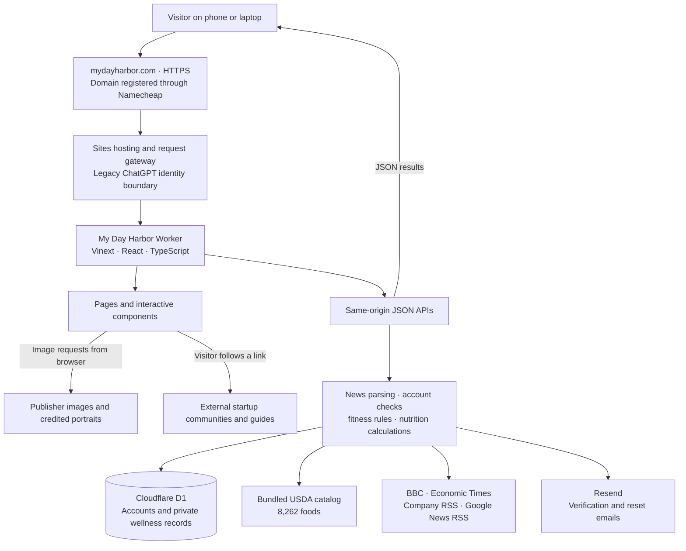
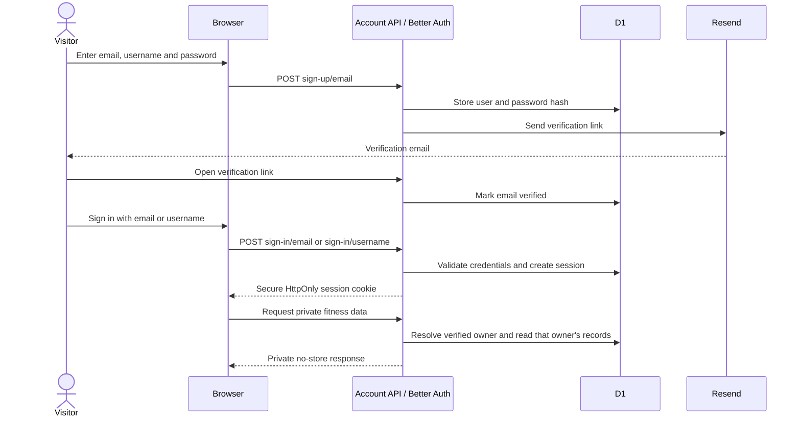
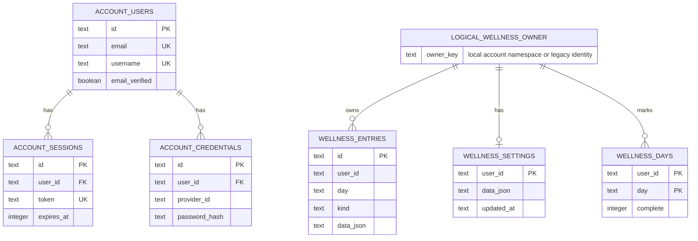
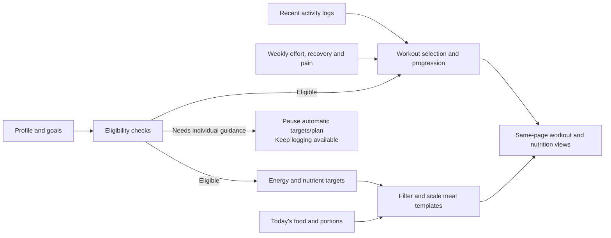
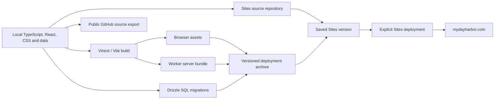

# My Day Harbor — Detailed Architecture

**Architecture snapshot: September 18, 2026**

Website: https://mydayharbor.com

Public source: https://github.com/tatachandra/daylight

This document describes the implemented application, based on the source code, database migrations, and Sites deployment records. It separates live functionality from optional source code and future ideas. It is an architecture review, not a fresh security audit, clinical validation, load test, or verification of every external feed.

## Contents

- [1. Executive view](#1-executive-view)
- [2. What is live, and what is only in source](#2-what-is-live-and-what-is-only-in-source)
- [3. System diagram](#3-system-diagram)
- [4. Technology stack](#4-technology-stack)
- [5. Pages and navigation](#5-pages-and-navigation)
- [6. News architecture](#6-news-architecture)
- [7. Tech Leaders architecture](#7-tech-leaders-architecture)
- [8. Accounts and identity](#8-accounts-and-identity)
- [9. Persistent data model](#9-persistent-data-model)
- [10. Fitness planning engine](#10-fitness-planning-engine)
- [11. Nutrition engine and meal suggestions](#11-nutrition-engine-and-meal-suggestions)
- [12. API map](#12-api-map)
- [13. Communities module](#13-communities-module)
- [14. Local time and browser storage](#14-local-time-and-browser-storage)
- [15. Security boundaries and data ownership](#15-security-boundaries-and-data-ownership)
- [16. Build, hosting and GitHub](#16-build-hosting-and-github)
- [17. Failure handling and operational limits](#17-failure-handling-and-operational-limits)
- [18. Existing validation](#18-existing-validation)
- [19. Growth path — proposed, not currently built](#19-growth-path--proposed-not-currently-built)
- [20. Source map](#20-source-map)

## 1. Executive view

My Day Harbor is a responsive, full-stack web application. Its pages, server-rendered components, JSON APIs, account service, and business rules live in one codebase and are deployed together as a Cloudflare-compatible Worker through Sites. This is a **modular monolith**: one deployed application with distinct modules, rather than separate microservices.

The main product areas are:

1. **News:** public publisher headlines, topic preferences, market-related coverage, and article images.
2. **Tech Leaders:** public person-based discovery across company announcements and publisher reports.
3. **Fitness & Nutrition:** account-private profiles, goals, workout plans, meal suggestions, nutrition estimates, logs, and weekly reviews.
4. **Communities:** a public directory of external founder communities, guides, and an idea-to-launch path.
5. **Accounts:** email or username/password sign-in, email verification, and password recovery; legacy ChatGPT identity remains separate.

Fitness recommendations use explicit rules and formulas. News uses RSS feeds. The current application does not call a generative AI model.

## 2. What is live, and what is only in source

Sites reports the project as **active and public**, with the live address `https://mydayharbor.com`. The latest saved version is **13**. Its deployment record reports **succeeded** and corresponds to source commit `cb81090efbca14a982637b30f37c062616e7dec6`.

The reviewed GitHub code baseline is commit [`01bf1d8`](https://github.com/tatachandra/daylight/commit/01bf1d897c115de14679b03febee695248a56c9d), which mirrors local source `0699b41` apart from the intentionally omitted live deployment identifier. It includes newer optional Google OAuth implementation and documentation. The difference from the deployed revision is confined to account-related files, a Google account test script, and documentation. **Google sign-in remains disabled by the owner's decision and is not a live login option.** A repository push is not a Sites deployment.

| Capability | Implemented position |
|---|---|
| Public News, Tech Leaders, Communities | Implemented in the deployed application |
| Private Fitness & Nutrition, meal/activity logs | Implemented in the deployed application |
| Personal email/username and password accounts | Implemented; runtime gated by account settings and email credentials |
| Legacy ChatGPT-linked accounts | Retained for existing data owners |
| Google sign-in | Optional newer source code; disabled and not published as an active login flow |
| AI chat/planning, wearable syncing, push reminders | Not implemented |
| Live stock prices or top-ten gainer rankings | Not implemented; market news is implemented |
| Internal social network, direct messages, nearby member matching | Not implemented; Communities links to external organizations |

## 3. System diagram

Sites manages the Worker deployment and the actual D1 resource binding. The repository declares a logical database binding named `DB`; it does not run a production database on the owner's laptop. `r2` is null in the hosting manifest, so no object-storage bucket is configured for this application.

## 4. Technology stack

| Layer | Actual implementation | Purpose |
|---|---|---|
| UI | React 19.2.6 and TypeScript 5.9.3 | Interactive pages and typed components |
| Routing/rendering | Vinext 1.0.0-beta.5, using Next-style App Router conventions | Server-rendered pages, client components, route handlers |
| Build | Vite 8.0.13 and Cloudflare Vite plugin | Build browser assets and Worker server output |
| Framework compatibility | Next 16.3.4 is a dependency | Supplies the Next-compatible application APIs used by the project |
| Styling | Tailwind CSS 4.2.1 plus custom CSS | Responsive layouts, Oat cream theme, white cards, soft fitness surfaces |
| UI primitives | Installed shadcn/Base UI/Radix components; Lucide icons | Dialogs, tabs, selects, inputs, accessible controls |
| Backend | TypeScript route handlers in the same Worker | Reads, validation, account checks, calculations, feed fetching |
| Database | Cloudflare D1, SQLite-compatible | Durable account and private wellness storage |
| Database access | Drizzle ORM 0.45.2 plus prepared D1 SQL | Better Auth adapter/schema and scoped wellness queries |
| Authentication | Better Auth 1.7.5 with username plugin | Passwords, sessions, verification and recovery |
| Email | Resend HTTP API | Account verification and password-reset delivery |
| Validation | Zod schemas | Validate profiles, dates, portions and API mutations |
| Nutrition source | Bundled USDA FoodData Central JSON | Food search and per-100-g nutrient calculations |
| Hosting | Sites on a Cloudflare-compatible runtime | Source versions, build archives, production deployment, private runtime settings |
| Source control | Local Git, Sites source repository, public GitHub copy | Development history and separate publication/export workflows |

These versions are read from this project's package manifest; they are not claims about the newest available releases. Production uses the Worker output, not a persistent Node server on the developer's computer. Node is used for development and building.

## 5. Pages and navigation

| Route | Role | Access |
|---|---|---|
| `/` | Personalized public news feed | Public; topics saved in that browser |
| `/tech-leaders` | Person selector, categories, posts, source status | Public |
| `/wellness` | Fitness & Nutrition dashboard | Page shell public; private data requires identity |
| `/communities` | External communities, guides, idea-to-launch stages | Public |
| `/account` | Sign-in, registration, verification, recovery | Public forms; authenticated operations inside the service |
| `/account/signout` | Personal-account sign-out screen | Uses current account session |
| `/design-preview` | Existing layout/color preview | Supporting preview route |

The main navigation has News, Fitness & Nutrition, and Communities. Tech Leaders is a News subview. The visible Fitness & Nutrition name uses the existing `/wellness` URL.

The root layout provides site metadata, the Balanced Leaves icon, shared styles, and a device-clock provider. News and Tech Leaders obtain initial feed data on the server, then client components handle filtering and refreshes. Fitness determines the signed-in identity on the server, then fetches private dashboard data through its APIs.

In Fitness & Nutrition, Workouts and Nutrition switch within the same page. Profile and review forms use dialogs. Session details expand inline. The existing detailed meal/activity logger is reused inside the newer dashboard.

## 6. News architecture

### Public headlines

`lib/news.ts` fetches four configured feeds in parallel:

- BBC World.
- BBC Technology.
- BBC Business.
- Economic Times Markets.

The parser extracts titles, links, publication dates, topic labels, publisher attribution, and eligible source-provided images. It validates HTTPS article hosts, excludes invalid timestamps and stories older than seven days, allows a small future-time tolerance, combines duplicate article IDs, and sorts newest first.

Topics are World, Technology, AI, U.S. markets, and India markets. Topic assignment uses source categories and keyword rules. The “For you” feed filters those topics according to browser-local preferences. It does not use a learned recommendation model or a server-side interest profile.

### Refresh and cache behavior

- Initial page rendering calls `getNews()`.
- The visible page requests `/api/news` every five minutes, with a manual refresh control too.
- The server has a five-minute **in-memory cache** and shares an in-flight fetch within the same Worker instance.
- Individual sources have a nine-second request timeout.
- Partial failures still return successful source results.
- If all sources fail and that instance has older results, it returns them as stale and delays another attempt for one minute.
- Without stories, the API returns 503.
- Response cache headers request 60 seconds of browser caching and 300 seconds of shared caching. Whether an intermediary caches the response depends on the hosting behavior.

The in-memory cache is not a durable news database and is not shared across all Worker instances. It can disappear when an instance restarts. There is no application background scheduler fetching news continuously after all visitors leave.

### Images

The browser loads images from the validated publisher image URLs. BBC images may use a larger rendition of the same attached image. News photographs are not copied into D1. As with ordinary external images, those image requests go to the image host.

## 7. Tech Leaders architecture

This module has a separate feed pipeline, data model, client component, and API.

`lib/tech-leaders-types.ts` defines 33 leaders, their matching aliases, technology categories, and four official feeds: OpenAI, Google AI, NVIDIA, and Microsoft. The loader also constructs free Google News RSS searches for selected people. In the all-leaders view, it groups five names per search, producing seven search feeds alongside the four official feeds.

The pipeline:

1. Fetch configured official feeds and generated Google News RSS queries.
2. Enforce a ten-second timeout and a 1.5 MB response-body limit per feed.
3. Parse supported RSS, rejecting feeds with entity declarations.
4. Match normalized full names/aliases in the headline, selected excerpt, or author field.
5. Keep posts from the past 30 days and no more than 40 parsed posts per source.
6. Remove common tracking parameters, deduplicate by resulting URL, and sort newest first.
7. Label results as company posts or publisher coverage, retaining original source attribution.
8. Return per-source availability, last successful check, and retained cached results where available.

Both source reads and leader-specific aggregate results use five-minute caches with in-flight deduplication. The endpoint sends 30-second HTTP cache headers. The client aborts superseded requests when a user changes leaders and refreshes every five minutes while visible.

Cards show an article image where available. Otherwise, an identified and credited Wikimedia Commons leader portrait may be shown; failed or unavailable images are omitted. A portrait is labeled as a portrait, not as a photograph of the reported event.

These are **not imported personal X posts**. Full-name matching can miss stories, and external searches can fail or return no results. Source-status UI exposes those conditions. This architecture explains why the feature can have incomplete coverage even while the website itself is healthy.

## 8. Accounts and identity

### Personal account flow

Account handling is mounted under `/api/account/*`. Better Auth handles credential hashing and verification, session management, and token workflows. The installed password implementation uses scrypt. The application does not implement its own password cryptography.

Configuration currently specifies:

| Control | Configuration |
|---|---|
| Username length | 3–30 characters |
| New password length | 15–128 characters |
| Email verification | Required for personal-account access |
| Verification link lifetime | 1 hour |
| Password-reset link lifetime | 30 minutes |
| Session lifetime | 7 days |
| Session update interval | 1 day |
| Session cookie cache | Disabled; session resolution uses the account service/database |
| Cookies | `mdh` prefix; Secure on HTTPS; Better Auth defaults to HttpOnly and SameSite=Lax |
| General rate limit | 30 requests per 60 seconds, with stricter endpoint rules |
| Sign-in rules | 5 requests per minute per rate-limit key |
| Sign-up/reset/resend rules | 5 requests per hour per rate-limit key |
| Password reset | Configured to revoke existing sessions |

Rate limits use database storage and the configured Cloudflare client-IP header. Their reliability depends on trustworthy gateway headers. These settings are implementation facts, not a guarantee against every attack.

Resend receives the destination email address and verification/reset message, including its link. The application uses `accounts@mydayharbor.com` as the sender. Health logs are not included in those messages.

### Two identity namespaces

`getSiteUser()` first tries a verified personal-account session. Its wellness owner key is `local:<account-user-id>`. If no verified personal session is available, it checks the legacy ChatGPT identity injected by the Sites request gateway.

Existing ChatGPT-linked logs keep their original owner ID. Personal accounts and legacy ChatGPT identities are **not automatically merged by matching email addresses**.

The legacy flow trusts gateway-supplied identity headers. A deployment on another host must replace that integration or ensure untrusted visitors cannot supply those headers. The private data endpoints must not be exposed behind a gateway that accepts caller-spoofed identity headers.

### Optional Google code

The newer source only enables Google when personal accounts are enabled and both Google client credentials are present. Its intended flow uses the same D1 account tables and explicit account linking; it does not merge health records by email. That code is not part of the currently deployed version-13 account implementation and activation remains stopped.

## 9. Persistent data model

The application has **eight declared D1 tables**. Public news stories and the food catalog are not D1 tables.

| Table | Main fields and purpose |
|---|---|
| `account_users` | ID, name, unique email, verification flag, unique username, optional image, timestamps |
| `account_credentials` | User relation, provider/account IDs, password hash field, optional provider token fields |
| `account_sessions` | User relation, unique session token, expiry, timestamps, optional IP/user agent |
| `account_verifications` | Identifier, value, expiration and timestamps used by auth verification workflows |
| `account_rate_limits` | Unique key, count, last request |
| `wellness_entries` | Entry ID, owner ID, local day, meal/workout kind, JSON payload, timestamps |
| `wellness_settings` | One row per owner; goals, preferences and nested fitness JSON |
| `wellness_days` | Composite owner/day key and complete-day flag |

`LOGICAL_WELLNESS_OWNER` in the diagram explains ownership; it is not an actual table. Wellness ownership is enforced by application queries rather than a foreign key to `account_users`, because the system supports both personal and legacy identities. In the real credentials table, the password-hash column is named `password`.

Authentication credentials and sessions have cascading foreign keys to account users. Wellness rows do not share that cascade. Full account deletion would therefore require explicit cleanup of associated wellness rows.

### JSON payloads

A meal stores a meal slot, notes, and items. Each item has an optional food ID, name, gram weight or null, original portion description, and `measured`, `estimated`, or `unknown` certainty.

A workout stores activity name, minutes, steps, user-reported calorie estimate, and notes. Minutes/steps/calories are not automatically obtained from a phone or watch.

`wellness_settings.data_json.fitness` stores:

- The personal fitness profile.
- Plan start date and baseline weight.
- Weekly reviews containing local day, current weight, effort, pain, recovery and notes.
- Up to 104 reviews; a new review replaces a prior review for the same day.

The profile contains name, age, sex reference, height, current/target weight, goal, experience, equipment, available days and minutes, activity level, diet, listed allergies, dislikes, selected health conditions, free-text health notes, and sleep hours. Current units are centimeters and kilograms.

An index on `(user_id, day)` supports wellness history queries. Settings updates merge JSON or update just the fitness key so the old logging settings and newer profile do not overwrite each other.

## 10. Fitness planning engine

`lib/fitness-plan.ts` computes the current view at request time. There is no model-training job, AI agent, personalized vector database, or externally hosted planner.

### Eligibility and health gates

Automatic targets are paused when age is outside 19–78, the sex reference is unspecified, a listed condition or health note is present, or current/target BMI is outside 18.5–40. A latest review reporting pain also holds the workout plan. These are the product's existing guard rules, not comprehensive medical screening.

### Energy and macronutrients

The implemented energy calculation is:

`resting energy = 10 × weight_kg + 6.25 × height_cm − 5 × age + sex-specific constant`

The constant is +5 for the male reference and −161 for the female reference. An activity factor of 1.2, 1.375, 1.55 or 1.725 estimates maintenance energy. The product applies a modest goal adjustment, rounds to 50-kcal increments, and displays a ±10% planning band. That band is not a statistical confidence interval.

Protein uses a product default of 1.2 g/kg or 1.6 g/kg for a muscle-building goal, capped at 30% of estimated energy. Fat is set around 30% of energy; carbohydrate is the remainder. Age/sex tables supply selected vitamin/mineral references. These describe the code, not an individualized dietary prescription.

Planned workouts are expected to be included in the selected usual activity level. Logged exercise calories are **not added again** to the food target. Selecting a different session does not trigger a separate exercise-energy model.

### Workouts and progression

The engine builds a foundation routine using equipment, training experience, available days, session duration, sleep, recent strength logs, and the latest review. Bodyweight, dumbbell, and gym paths use small curated exercise sets. Two available days produce two strength sessions; other settings generally produce three strength sessions, with optional easy cardio for four/five-day availability.

Progression is a rule-based change in sets. A recent easy/good-recovery review, adequate logged strength days, no pain, and at least the third week can suggest an extra set. Short sleep or a demanding/tired recent review reduces sets. It does not invent an entirely new program each week or automatically progress load from weight loss alone.

Training references include the six supplied WeightTraining.guide and Muscle & Strength libraries. The application provides original routines and links to source technique libraries; it has not imported or republished their entire catalogs. Removing the bottom sources panel did not remove those internal references or exercise links.

## 11. Nutrition engine and meal suggestions

### Food reference data

`lib/food-catalog.json` contains **8,262 foods**, approximately **5.25 MB** of JSON:

- 7,793 USDA SR Legacy records labeled April 2018.
- 469 USDA Foundation Foods records labeled April 2026.

The catalog is bundled with the application and queried on the server. It is not refreshed from USDA on every request. Updating it requires changing the source dataset and deploying the new application.

Food search normalizes simple synonyms such as “dal” → “lentils” and “curd” → “yogurt,” scores name matches, and returns at most 30 results. An empty search returns featured foods. This is a small linear search, not a separate search service.

### Calculation model

For each known item and nutrient:

`item nutrient = reference amount per 100 g × entered grams / 100`

Totals keep both a known amount and coverage count: for example, how many of the logged foods supplied that nutrient. Missing portions, unlisted foods, or unavailable nutrient fields do not become known zeros. Explicit database zeros remain zeros.

The nutrient registry includes protein, fiber, magnesium, 13 vitamin entries, amino-acid entries, energy/macronutrients, minerals, choline, saturated fat, and selected omega-3 forms. Coverage differs by food. Vitamin K is K1 only; niacin is not niacin equivalents; cysteine/asparagine/glutamine can remain unknown. The product does not guarantee data for every nutrient or a personalized amino-acid requirement.

### Two suggestion paths

| Path | How it works |
|---|---|
| New dashboard meal plan | Nine curated combinations; chooses breakfast/lunch/dinner/snack options by diet and exclusions; rotates choices by date; scales portions toward estimated remaining energy |
| Detailed food-log suggestions | Six combinations ranked against protein/fiber/magnesium gaps in days with food entries; returns three options |

The dashboard supports vegan, Indian-inspired, and American-style preferences. The Indian-inspired templates restrict meat choices to chicken, shrimp, and fish. The American-style category is a limited starter collection, not a comprehensive menu of all American foods.

For the daily plan, logged meal slots are removed. Remaining calories are calculated only when logged energy data and portions are complete. With incomplete logs, the engine uses the normal remaining meal shares and shows that limitation. Scaling is bounded, so the menu is not guaranteed to exactly hit energy or every micronutrient target. Allergens and comma-separated dislikes filter the templates; this does not establish brand-level allergy safety or cross-contact protection.

The historical suggestions exclude completely unlogged days. Partial days still can understate intake. Low logged totals are not diagnosed as a nutritional deficiency.

## 12. API map

| Endpoint | Methods | Identity and purpose |
|---|---|---|
| `/api/news` | GET | Public aggregate headlines, freshness and unavailable sources |
| `/api/tech-leaders?leader=…` | GET | Public posts for all or a validated known leader |
| `/api/foods?q=…` | GET | Public food reference lookup; query clipped to 100 characters |
| `/api/wellness?from=…&to=…` | GET | Private entries, settings, completion flags, summaries and suggestions |
| `/api/wellness` | POST | Private `save-entry`, `delete-entry`, `save-settings`, `complete-day` actions |
| `/api/fitness?day=…` | GET | Private profile, recent history, computed targets, workout and daily meal plan |
| `/api/fitness` | POST | Private `profile`, `review`, `delete-profile` actions |
| `/api/account/[...all]` | GET, POST | Better Auth handler for registration, sign-in/out, sessions, verification and password reset |

Wellness GET accepts up to a 31-day date span and returns at most 1,000 entries. The current logger normally asks for seven days. Fitness GET reads from the requested day minus 28 days through that day, inclusive, with a 1,500-row cap. These endpoints currently use limits without history pagination.

Private responses use `private, no-store`; public food results allow one-hour caching. Mutations validate JSON inputs, dates, fields and ownership. Wellness mutation bodies are limited to 50,000 text characters, fitness bodies to 12,000, and the account wrapper checks a 16,384-byte advertised Content-Length. This last check is not a full streamed-body size limiter.

### Example: logging a meal

1. The browser searches the public food catalog.
2. The user chooses a food, records the portion and its certainty.
3. The client sends a meal entry to `/api/wellness`; it does not choose the data owner.
4. The server resolves the current verified identity and validates the payload.
5. For catalog foods, the server supplies the catalog name and validates the food ID.
6. A prepared SQL statement saves the entry under the authenticated owner.
7. The browser reloads logs and the dashboard; totals and suggestions are recomputed.

## 13. Communities module

This is a curated directory shipped in `lib/community.ts`, with eight programs/networks, six guides and a six-stage path: Discover, Validate, Plan, Build, Launch and Improve.

The client filters the collection by keyword, region and purpose. Joining, registering, finding local events, and contacting people happens on the linked organization's website. My Day Harbor does not import member profiles, verify nearby availability, host member chat, or store a social graph.

The directory is manually maintained with the source code. Its availability and price descriptions can become outdated and should be reviewed periodically. There is no live community-provider integration or CMS in this release.

## 14. Local time and browser storage

`DeviceTimeProvider` waits until the browser is running before presenting local dates. It updates the clock every 30 seconds while visible and on focus/visibility changes. Locale formatting uses the visitor's device timezone, including daylight-saving behavior.

News timestamps are stored/transmitted as ISO timestamps and displayed locally. Wellness entries store a separate `YYYY-MM-DD` local day alongside creation/update timestamps. Travelling to another timezone changes the current display/day selection; existing log-day labels are not automatically reassigned.

| Data | Where it lives |
|---|---|
| News topic preferences | Browser localStorage, key `daylight-topics` |
| Selected tabs and open forms | React state in the current page |
| Session credential | Secure HttpOnly browser cookie plus server-side session data |
| Profiles, health notes, meals, workouts, reviews | Hosted D1 |
| Public nutrient references | Bundled catalog JSON |
| News cache | Worker-instance memory, temporarily |
| Local synthetic test database | Ignored `.wrangler` state or isolated test runtime |

Topic preferences do not currently sync across accounts/devices. Health logs are not kept in browser localStorage. The repository has no offline-first sync system, native iPhone application, service-worker push scheduler, or automatic health-sensor integration.

## 15. Security boundaries and data ownership

The key boundary is between public content and account-private data. Public APIs never need a health profile. Private APIs resolve identity on the server and bind that owner ID into reads, writes and deletes.

The implementation includes password hashing, verified email gating, server-side sessions, database-backed account throttling, request-origin checks, input validation, prepared SQL, owner-scoped updates/deletes, and private no-store responses. Account pages also request no indexing and a no-referrer policy.

The fitness and account POST handlers require a matching Origin and reject cross-site requests. The wellness POST handler rejects a mismatched supplied Origin or a cross-site fetch marker, but does not require Origin to be present. This distinction should be retained in future security review rather than described as identical validation everywhere.

Private configuration includes `BETTER_AUTH_SECRET` and `RESEND_API_KEY`. Runtime controls include `PERSONAL_ACCOUNTS_ENABLED` and `ACCOUNT_BASE_URL`. Optional, disabled Google integration has `GOOGLE_CLIENT_ID` and `GOOGLE_CLIENT_SECRET`. No secret values are included in this document.

The app does not implement end-to-end encryption for wellness JSON. “Private” means access-controlled account storage, not that infrastructure operators are cryptographically unable to read it. This document does not establish healthcare compliance certification.

Deleting a fitness profile sets the nested fitness record to null; it does not delete all meal/workout records or the login account. Individual logs can be deleted separately. A complete self-service account/data export and deletion workflow is not present in the reviewed UI.

## 16. Build, hosting and GitHub

The normal Worker entry is `dist/server/index.js`; browser assets and generated migration/configuration files are packaged with the build. The hosting manifest requests `DB`; Sites owns the actual Cloudflare database ID and wiring. Local development uses a placeholder binding and local emulation, not the production database by default.

Database changes have two migration files: one creates wellness tables; the next creates account tables. Profiles and reviews were added inside the existing settings JSON, so that feature needed no new table migration.

GitHub holds a shareable source copy. The public export omits the live Sites project identifier and private runtime data. Secrets, local databases, and user logs are not part of that export. The original Sites deployment and GitHub copy are separate publication paths; pushing a GitHub commit alone does not update the live site.

The domain was registered through Namecheap and connected to Sites. Resend domain-verification records support email sending; they do not host the website or hold fitness data. Exact current DNS record values and registrar billing were not needed for this code-based review.

## 17. Failure handling and operational limits

| Failure | Current behavior |
|---|---|
| One news publisher fails | Successful feeds remain usable |
| All headline feeds fail | Use existing instance cache as stale if available; otherwise empty/error response |
| A Tech Leaders source fails | Expose source health and retain that source's prior posts in the running instance where available |
| A user switches leaders mid-request | Client cancels superseded request and protects the selected view |
| Food search fails | UI can offer retry or an unlisted food with unknown nutrients |
| D1 is unavailable | Private APIs return an error; forms keep entered information for retry |
| Email service fails | Account email operation fails; runtime logging/retry/delivery monitoring need operational follow-up |
| Automatic plan is unsuitable | Pause recommendations while keeping logs available |
| Image fails | Hide or fall back to a credited portrait where configured |

The source contains console-based error reporting and source-status UI. A dedicated production monitoring dashboard, alerting pipeline, durable email job queue, shared persistent news cache, and proven database restore procedure are not established by this repository review.

D1 capacity assigned by Sites, remaining storage, hosted request allowances, email sending allowance, and runtime resource ceilings remain unverified. The architecture uses no paid AI inference API, but that does not establish unlimited free hosting, email, or domain renewal.

## 18. Existing validation

The repository includes focused checks for:

- Device-local dates, midnight and daylight-saving behavior.
- Portion calculations, missing nutrient values, validation and food logging.
- Feed parsing, name matching, source labels, safe URLs, cache behavior and outages.
- Account registration, verification, sessions, reset-token reuse and session revocation.
- Fitness eligibility gates, diet restrictions, meal replanning, D1 owner isolation and preservation of settings JSON.
- Optional Google sign-in and explicit linking using synthetic responses, separate from actual live Google activation.

Important files are `scripts/check-device-time.mjs`, `check-wellness.mjs`, `check-wellness-api.py`, `check-tech-leaders.mjs`, `check-accounts.mjs`, `check-fitness.mjs`, and `check-google-accounts.mjs`.

This architecture task inspected those checks and verified the deployment record; it did not rerun all tests, send account emails, read real user logs, or modify the deployed site.

## 19. Growth path — proposed, not currently built

The current single application is practical for this stage. The next improvements can stay within that structure:

1. **Persistent feed cache and scheduled refresh, if needed:** reduce repeated RSS calls across Worker instances and make the last successful feed survive restarts. This requires deliberate storage/scheduling support and quota review.
2. **Account lifecycle:** implement full export/deletion with explicit cleanup across both auth and wellness records; preserve legacy identity separation until a verified linking flow is designed.
3. **Monitoring and recovery:** record request failures, email delivery outcomes and feed health, and establish database backup/restore procedures.
4. **Data model evolution:** move long review history into a dedicated table, add pagination, and use concurrency controls if simultaneous profile edits become common. The current read-modify-write JSON review flow can conflict across concurrent requests.
5. **Nutrition and planning quality:** expand curated templates and food coverage, version reference data and rule changes, add unit conversion, and validate calculations with qualified domain reviewers.
6. **Performance:** measure cold-start and food-search costs before replacing the bundled catalog with indexed storage or a search service. Measure actual traffic before introducing microservices.

AI assistance, wearables and notifications would each be separate features with their own consent, reliability and cost decisions. They are not hidden dependencies of the current site.

## 20. Source map

| Area | Main source files |
|---|---|
| Stack/build | [package.json](../package.json), [vite.config.ts](../vite.config.ts), [scripts/run-framework.mjs](../scripts/run-framework.mjs), [build/sites-vite-plugin.ts](../build/sites-vite-plugin.ts) |
| Deployment declaration | [.openai/hosting.json](../.openai/hosting.json) |
| Root UI and time | [app/layout.tsx](../app/layout.tsx), [app/device-time.tsx](../app/device-time.tsx), [lib/device-time.ts](../lib/device-time.ts) |
| News | [app/page.tsx](../app/page.tsx), [app/design-preview/preview.tsx](../app/design-preview/preview.tsx), [lib/news.ts](../lib/news.ts), [app/api/news/route.ts](../app/api/news/route.ts) |
| Tech Leaders | [app/tech-leaders/feed.tsx](../app/tech-leaders/feed.tsx), [lib/tech-leaders.ts](../lib/tech-leaders.ts), [lib/tech-leaders-types.ts](../lib/tech-leaders-types.ts), [lib/tech-leader-portraits.ts](../lib/tech-leader-portraits.ts) |
| Fitness UI/rules | [app/wellness/fitness-dashboard.tsx](../app/wellness/fitness-dashboard.tsx), [lib/fitness-profile.ts](../lib/fitness-profile.ts), [lib/fitness-plan.ts](../lib/fitness-plan.ts) |
| Meal/activity logger | [app/wellness/wellness.tsx](../app/wellness/wellness.tsx), [app/api/wellness/route.ts](../app/api/wellness/route.ts) |
| Food and nutrients | [lib/nutrition.ts](../lib/nutrition.ts), [lib/nutrients.ts](../lib/nutrients.ts), [lib/food-catalog.json](../lib/food-catalog.json), [app/api/foods/route.ts](../app/api/foods/route.ts) |
| Profiles API | [app/api/fitness/route.ts](../app/api/fitness/route.ts) |
| Personal accounts | [lib/accounts.ts](../lib/accounts.ts), [lib/account-config.ts](../lib/account-config.ts), [app/account/form.tsx](../app/account/form.tsx), [app/api/account/[...all]/route.ts](../app/api/account/[...all]/route.ts) |
| Legacy identity | [app/chatgpt-auth.ts](../app/chatgpt-auth.ts) |
| Database | [db/schema.ts](../db/schema.ts), [db/index.ts](../db/index.ts), [db/wellness.ts](../db/wellness.ts), [drizzle/](../drizzle/) SQL migrations |
| Communities | [lib/community.ts](../lib/community.ts), [app/communities/community.tsx](../app/communities/community.tsx) |
| Branding/styles | [app/brand-mark.tsx](../app/brand-mark.tsx), [public/balanced-leaves.png](../public/balanced-leaves.png), [app/globals.css](../app/globals.css), [app/fitness.css](../app/fitness.css), supporting page CSS |

For a new developer, start with the route pages, then the corresponding API handler and library. Treat the account identity boundary and owner-scoped database queries as invariants when changing private features.

## Maintaining this document

Update the snapshot date and the relevant sections when routes, database schemas, identity handling, runtime settings, data sources, calculation rules, or deployment behavior change. Record the code revision reviewed and distinguish deployed behavior from code that is only prepared or disabled. Recheck diagrams after structural changes.

Keep API keys, passwords, session tokens, verification links, real health records, private configuration values, and database exports out of this public document. Environment-variable names and synthetic examples are sufficient for explaining the system.

Related documentation: [project README](../README.md), [Tech Leaders source planning](plans/personal-announcements-feed.md).
