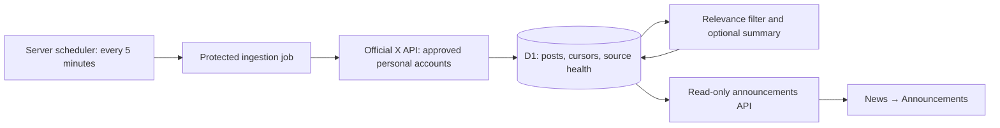

# My Day Harbor: personal announcements feed

Design proposal · September 16, 2026 · inspected checkout `1fe825a` · revised for a zero-cost requirement

## September 17 implementation update

The user approved free official announcements and news sources, then clarified that **Tech Leaders must display posts related to the individual people**, rather than a profile directory. The implemented route is `/tech-leaders`, accessible from a News view switch. It includes all 33 names in a person selector. Free Google News RSS searches supply publisher headlines; four official feeds supply posts only when a headline, excerpt or author explicitly names a listed leader. Company affiliation alone does not establish relevance. Reports and company posts have distinct labels; no personal X posts are imported and no candidate handle is promoted to API-verified.

This implementation uses public HTTP feeds with no API keys, paid service, new database, AI service or scheduler. Refresh runs on page load and every five minutes while visible; it does not promise unattended monitoring or comprehensive coverage. Selection-specific requests are cached, overlapping requests share work, source failures retain any available cached posts, and invalid person inputs are rejected. Publisher excerpts are plain text, links are constrained to source hosts, and images use original-source attachments when available, with explicitly labeled and credited Wikimedia Commons portraits as a fallback for the relevant leader. Missing or failed images are omitted. The source list below was an earlier design exploration; its paid architecture is not the implemented version.

## Cost constraint: no paid services

The user has explicitly said, **“i dont want to pay anything.”** This replaces the earlier proposal to obtain a paid X connection or run a budgeted pilot. The permitted additional spend for this feature is **$0**. Do not purchase credits, add a payment method, enable paid APIs or AI summaries, start a trial that converts to billing, or add a scheduler/hosting service that can incur charges. Do not ask for paid credentials under this plan.

No paid service was activated during this mapping. This instruction does not cancel or alter the user's existing domain registration or other accounts, and this document does not certify their billing status.

The official X retrieval path described below is excluded from the current implementation scope because X charges for API reads. A reliable zero-cost method for continuously discovering all candidate accounts' announcements every five minutes has **not** been established. Do not promise that coverage, treat a public profile link as a monitored feed, or present an embedded known post as automatic discovery. [X API pricing](https://docs.x.com/x-api/getting-started/pricing)

The smallest zero-cost direction is a reviewed directory of personal profile links and manually selected original-post links. Keep the existing publisher news feed available separately. Investigate personal blogs or RSS feeds only where they actually exist and their use is permitted. Company newsrooms and publisher coverage would be an explicitly labeled alternative requiring agreement to broaden the personal-account-only scope; they are not a silent substitute.

Preserve the existing repository mapping, design, device-local times, and 33-person research roster. All candidate sources remain disabled and API-untested. For an initial links-only view, use static reviewed data and the existing news shell; new ingestion tables, provider credentials, AI processing, and a scheduled job are unnecessary. Add no infrastructure until its use within a confirmed free allowance is established; pause or limit work at a free limit rather than enable paid overages. Five-minute browser refresh of the existing publisher feed is distinct from unattended personal-account monitoring.

The subsequent September 17 user instruction authorized implementation on the website and broadened the sources to free reporting. The implementation update above supersedes the earlier links-directory fallback; the zero-cost constraint remains in force.

## Earlier architecture: reference only, superseded where it requires payment

The sections below retain the repository findings and original technical exploration. Paid pilots, credential requests, spending-cap proposals, and funded summaries below are **not active next steps**. The zero-cost requirement above governs any future work.

This document maps the requested feature onto the current repository. No application code, database schema, production settings, or deployment was changed. No paid X or AI request was made. The source roster is research input, not a list of monitored or API-verified accounts.

## Product placement

Add **Announcements** inside **News**, beside the publisher-headline experience. Keep the main navigation as News / Meals & Fitness / Communities. Use a small News / Announcements view switch and a shareable `/announcements` route. In that view, the existing laptop sidebar becomes technology-category filters; on a phone it becomes a horizontal selector. Retain Oat cream, white cards, Balanced Leaves, and device-local dates.

The first screen should contain the feed, category controls, and honest freshness status. Each item identifies the person, @handle, associated company/project, category, original publication time, original X post, and a separate **Generated summary** when one is available. Company labels describe associations, not proof that someone speaks for the company. Multi-company people require post-specific attribution.

Only personal accounts supply this view. Keep company newsrooms and publisher articles outside it unless the user explicitly chooses a separately labeled fallback later. A person's off-topic post should not qualify simply because they are on the roster.

## What exists, and what can be reused

| Existing file / facility | Current behavior | Mapping |
| --- | --- | --- |
| `app/page.tsx:1` | Home imports `DaylightNews` from the design-preview directory with `preview={false}` | This is the actual live news implementation. A change only to `app/newsroom.tsx` would miss the live page. |
| `app/design-preview/preview.tsx:21` | Responsive feed, categories, browser-saved interests, freshness notices, inline navigation | Extract a small shared news shell/header so Home, Announcements, and the design preview remain consistent. Preserve existing RSS behavior. |
| `app/primary-nav.tsx:2` | Shared main navigation used by other sections | Keep the same three destinations; Announcements belongs to News. Avoid creating a fourth main tab unnecessarily. |
| `lib/news.ts:1` | `Story` and `NewsData`; five RSS topics | Keep these models for publisher news. Add distinct announcement types: the existing Story has no author identity, summary provenance, or per-account status. |
| `lib/news.ts:47` / `app/api/news/route.ts` | RSS loaded on demand; Worker-memory cache; public HTTP cache | Do not use this memory cache as the announcements database or put paid X fetches behind the visitor Refresh button. |
| `app/design-preview/preview.tsx:32` | Browser interval checks every 300,000 ms while visible | Reuse for refreshing our stored announcement feed only. It is not a background account-monitoring service. |
| `app/device-time.tsx:23` / `lib/device-time.ts` | Local publication times after client hydration | Reuse for post, last-attempt, and last-success times; store canonical UTC timestamps. |
| `db/schema.ts:2`, `db/wellness.ts`, `app/api/wellness/route.ts` | D1 tables and prepared-statement access for private wellness records | Add separate public announcement tables and a dedicated D1 helper; do not join private wellness data into the feed. |
| `drizzle.config.ts`, `drizzle/0000_ordinary_harrier.sql` | Existing migration workflow | Append a generated migration; preserve the applied migration and its metadata. |
| `.openai/hosting.json` | Existing Sites project with logical D1 binding `DB`; R2 disabled | Reuse D1; no new site or image-storage bucket is needed. |
| `vite.config.ts`, `build/sites-vite-plugin.ts` | Vinext fetch handler and Sites packaging | No configured cron or queue. Generated Wrangler output has empty triggers. Scheduler deployment support remains to be established. |
| Production environment inspection | Site active/public; configured environment-variable list empty | No X or model-provider credential is configured through the Sites runtime settings. No root `.env`, `.env.local`, `.env.example`, or `.dev.vars` was present. This does not inspect account entitlements or unrelated credential stores. |

## Field and data model

All following tables are **proposed additions**, not current tables.

| User-visible field | Storage / mapping |
| --- | --- |
| Person | `announcement_sources.person_name`; manually reviewed identity, not inferred from a badge |
| Company/project | `affiliations_json` on the source; relevant `companies_json` snapshot on a post; permit multiple associations |
| Personal X account | `handle`, `profile_url`, API-resolved `x_user_id` stored as TEXT, `display_name`, `avatar_url` |
| Original post | `announcement_posts.post_id` TEXT primary key, `source_id`, `original_text`, `entities_json`, `original_url`, `published_at`, `fetched_at` |
| Generated summary | Nullable `summary_text`, `summary_status`, `summary_model`, `summary_version`, `summary_input_hash`, `summary_generated_at`; separate from original text |
| Technology category | `categories_json`: AI, Chips, Robotics, Space, Fusion, Brain interfaces, Other technology; separate from the existing RSS Topic union |
| Announcement type | `event_type`: product launch, research release, technical milestone, partnership, significant company development |
| Original / quote / reply / repost | `post_kind`, `referenced_post_ids_json`; preserve attribution and relationships |
| Why shown / review | `relevance_state` (accepted/rejected/review), `relevance_reason`, `filter_version`; internal review state is not a public “verified announcement” badge |
| Edits / removals | `edit_history_ids_json`, `canonical_post_id`, `content_hash`, `availability_state`, `last_revalidated_at`; hide unavailable items and invalidate affected summaries |
| Last check | `announcement_sync_state.last_attempt_at`, `last_success_at`, `last_new_post_at`, `last_error_code`, `next_retry_at`; do not collapse these into one checkedAt value |

Five tables suffice initially:

1. **announcement_sources**: identity/profile fields, affiliations, separate verification states, `enabled=false` by default.
2. **announcement_source_evidence**: source ID, evidence URL/type, what it supports, evidence publication date (nullable), review date, reviewer note. Identity evidence and announcement-use evidence are different claims.
3. **announcement_sync_state**: one row per source; committed cursor, working pagination window/token, pending high-water mark, coverage start, attempt/success state, expiring lease.
4. **announcement_posts**: fields above; indexes on publication time and (source, publication time); edit-chain grouping avoids showing versions as separate announcements.
5. **announcement_sync_runs**: run/source status, timing, request/resource counts, estimated reserved/used cost, errors and continuation information. This supports restart recovery and an application spending guard; it does not replace the provider's billing ledger.

Use existing D1 prepared statements and atomic batches. IDs are strings, never JavaScript numbers. Schema migrations remain schema-only; candidate registration happens through an explicit, idempotent import later.

## Keep identity, activity, and access separate

Use independent source states:

- `identity_status`: candidate / confirmed / disputed; confirmation requires credible identity evidence.
- `activity_status`: unknown / recently_observed / historical_only; record `last_observed_post_at` and when it was checked.
- `api_status`: untested / accessible / rate_limited / unauthorized / unavailable; record the last successful API check.
- `enabled`: explicit monitoring choice, default false.

A valid API lookup confirms that an account exists and supplies a stable ID; it does not by itself prove who controls it. An old announcement proves historical activity, not current posting. An X badge is not this application's identity review.

The companion candidate JSON preserves all **33 people**, including **28 supplied handles** and **five unresolved handles**. Every entry starts disabled, identity-unreviewed, activity-unknown, and API-untested. Prior evidence URLs are labeled as inherited research, not freshly validated here. Larry Ellison and Melanie Perkins need particular freshness review. David Kirtley's intended candidate is **dekirtley**, not Dkirtley. No handle is invented for Larry Page, Sergey Brin, C. C. Wei, Christophe Fouquet, or Jeremy O'Brien.

## Retrieval and five-minute scheduling

Proposed flow:

Use API-resolved stable user IDs with `GET /2/users/{id}/tweets`. Request required fields such as author, creation time, entities, post references and edit history; request full long-post data where supported. Use `since_id`, bounded time windows and pagination. The official timeline guide documents these mechanisms and exclusion of replies/reposts. Endpoint access still needs an authenticated test after approval. [X timeline integration](https://docs.x.com/x-api/posts/timelines/integrate)

For each cycle: acquire an expiring lease; reserve budget; fetch bounded pages; persist each page idempotently; advance the committed cursor only after the entire window is durably accounted for. If interrupted, retain the old committed cursor and resume/replay the unfinished window. Classify after storage so a summary error cannot lose a post. A zero-result response counts as a successful check.

Use bounded concurrency and jitter. Honor rate-limit reset headers; retry transient failures; surface authorization, credit, or source-access errors. Do not retry endlessly. The published per-app timeline allowance is 10,000 requests per 15 minutes, but the actual account/endpoint response remains authoritative. Twenty-eight sources checked every five minutes imply about 84 baseline requests per 15 minutes and 8,064/day before pagination—not that many billable posts. [X rate limits](https://docs.x.com/x-api/fundamentals/rate-limits)

**Scheduler gap:** Cloudflare Workers supports scheduled handlers and cron triggers, but the current Sites connector and inspected packaging references do not expose a documented cron-management facility. This is unconfirmed capability, not proof that Sites cannot support it. A local `triggers` edit alone is not evidence of a production schedule. [Cloudflare Cron Triggers](https://developers.cloudflare.com/workers/configuration/cron-triggers/)

First prove the supported production scheduling path. If Sites supports it, wrap the existing Vinext fetch handler with a scheduled handler. If not, propose an external scheduler calling a signed, replay-protected `POST /api/internal/announcements/sync`; keep the website and D1 on Sites. The job secret stays server-side, and arbitrary visitors cannot trigger paid retrieval. No desktop timer, Codex heartbeat, or always-open browser is suitable. No scheduler is activated in this planning step.

Five minutes is the polling target, not a delivery guarantee. Provider delays, retries, pagination, processing and the visitor's next refresh add latency. Show per-source failures and “Last successful check,” not “everything is up to date” after partial success. Preserve stored items during outages. Do not let an additional five-minute CDN cache accidentally double the UI refresh delay.

## Filtering, summaries, and display

Recommended initial behavior, subject to a scope choice: original posts and substantive quote-post commentary; exclude bare reposts and replies. Excluding replies can miss announcements or details in self-threads, so record that limitation and make the policy configurable.

Require both a relevant technology subject and an announcement event. Avoid blanket keyword matches on all posts by famous people. Begin with explicit rules, reviewable reasons, and an uncertain/review state. Measure false positives and missed announcements on labeled fixtures before enabling automatic inclusion. Rules can shortlist posts; reliable abstractive summaries require a separately selected and funded model service.

Summarize once per accepted post/content version and share the stored result. Label it **Generated summary**, retain attribution, and never convert a forecast or company claim into an established fact. If quoted context, linked research, long text, or media context is unavailable, omit the summary or clearly mark its limited basis. Treat retrieved text as data; a summarizer has no tools and cannot change sources, credentials, or instructions.

The existing headline card is insufficient for displaying original X content. Prefer official embedded posts with a distinct summary panel; blocked embeds get a clear original-post link. Custom rendering would also need linked author avatar/name/@handle, unchanged post text/entities, linked timestamp, X branding, and the appropriate actions or “View on X.” Confirm storage, redisplay and AI-processing terms before launch; a summary label alone does not establish permission. Account/post deletion and edit handling must include derived summaries. [X display requirements](https://docs.x.com/developer-terms/display-requirements)

No made-up posts or generated images of announcements. Offline fixtures use conspicuously fictional test accounts and never enter the public feed.

## Proposed file additions and changes

| Location | Work |
| --- | --- |
| `app/news-shell.tsx` (new), live `app/design-preview/preview.tsx` | Share branding, main navigation, News/Announcements switch; preserve the functioning preview |
| `app/announcements/page.tsx`, `feed.tsx`, `announcements.css` (new) | Stored feed, technology filters, source details, summary/original distinction and freshness states |
| `app/api/announcements/route.ts` (new) | Public read-only, bounded cursor pagination/filter validation; never fetches X or calls a model |
| `lib/announcement-types.ts`, `lib/announcements.ts` (new) | Public DTOs separate from RSS and internal verification/admin data |
| `lib/x-client.ts`, `lib/announcement-sync.ts`, `lib/announcement-filter.ts` (new) | Server-only transport, durable cursor algorithm, relevance policy |
| `lib/announcement-summary.ts` (later) | Optional selected-provider integration; disabled until separately approved |
| `db/announcements.ts`, `db/schema.ts`, new `drizzle/*` migration | Public-feed persistence and bounded prepared queries |
| `cloudflare-env.d.ts`, ignored local environment / example keys | `X_BEARER_TOKEN`, optional job secret, enable/budget settings; never public-prefixed credentials |
| `worker.ts` + `vite.config.ts` OR protected internal sync route (conditional) | Implement only the scheduling path verified for production |
| `scripts/check-announcements.mjs`, API tests (new) | Offline normalization/cursor/filter checks plus read-vs-ingest isolation and storage failures |
| `README.md` (later) | Source policy, funding/scheduling setup, deletion behavior, limitations |

Do not modify generated `dist/` files or wellness endpoints. Keep source setup owner-only; wellness sign-in currently grants access to one's own logs, not administrative rights to edit the monitored roster.

## Smallest sensible sequence

1. **Offline foundation:** add schema/types, disabled candidate import, read-only feed route, shared shell and honest “not connected” UI. Use labeled test fixtures only. No credentials are needed for this stage.
2. **Source review:** validate personal identity and recent activity separately for candidate accounts; resolve stable IDs only once an approved X connection exists. Keep unresolved/disputed accounts disabled. Do not silently replace them with companies.
3. **Scheduling proof:** establish supported production scheduling and authenticated job invocation using a harmless dry-run before attaching paid retrieval. Confirm the job runs with all browsers closed.
4. **Budgeted X pilot:** after a spending cap and credential setup, test a small source subset, bounded initial lookback and cursor recovery; then expand to the reviewed roster.
5. **Filtering and summary choice:** apply the agreed post-type policy; validate relevance. Add generated summaries only after provider, processing terms and budget are settled. Original-post-only is a possible first release, but an explicit scope choice.
6. **Release checks and rollout:** prove duplicate/overlap safety, pagination retry recovery, empty checks, provider errors, stale indicators, edits/deletions, budget stop, public-read isolation, unchanged wellness privacy, and phone/laptop usability. Run the existing build/check workflow, then publish only under a later implementation/release instruction.

## Earlier decisions and credentials — excluded by the zero-cost requirement

No decision or credential is needed to complete this mapping.

Before any paid live test:
- An **X Developer project/app with the needed read access**, its server-side token supplied securely, and an approved monthly spending cap. GitHub or ordinary X browser sign-in does not supply this.
- Confirmation of the proposed originals-plus-substantive-quotes policy, including whether self-thread replies matter.
- A choice between an original-post first release and generated summaries from day one. Generated summaries need their own provider/credential/budget approval; none is currently configured.
- A scheduler connection only if the supported Sites path cannot satisfy the requirement. Do not ask the user to pick hosting before this technical capability check.

X currently lists post reads at **$0.005 per returned resource**. At an illustrative 300 new posts/day for 30 days, post reads alone would be **$45**; this is not a forecast or approved budget. Profile reads, revalidation/backfill, infrastructure and optional AI may add cost. Filtering after retrieval does not erase read charges. X documents same-UTC-day deduplication as a soft guarantee, so it is not a cost-control substitute. Use provider spending limits plus an application budget guard and pause visibly when capped. Recheck rates in the Developer Console before activation. [X pricing](https://docs.x.com/x-api/getting-started/pricing)

**Current status:** the free Tech Leaders view is implemented as described above. Paid integration is excluded; continuous five-minute personal-X discovery remains outside this release. Publication status is tracked separately by the Sites deployment.
